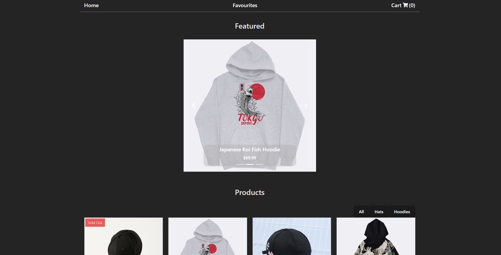
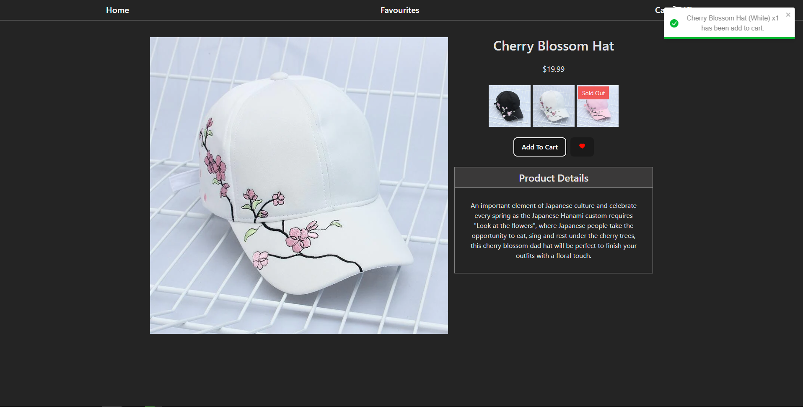

# e-commerce-app

## Preview

### Desktop

#### Home Page



#### Product Page



## Deployed Version

- [Link](https://e-commerce-mock-app.vercel.app/)

## Setup

- To install dependencies open terminal cd into the root folder

```
npm install
```

- Run Application

```
npm run dev
```

## Description of project (spec / MVP)

### Stack

- Frontend
  - React
  - CSS/SCSS
  - React Router DOM
- Backend
  - Firebase/Firestore

### Outline

This project is designed to reinforce your React learnings and make sure that you are comfortable with most aspects of the framework. With this project you will practice how to:

- Fetch Data within a React App
- Use react-router-dom
- Use Firebase/Firestore

### MVP:

At a minimum your e-shop website should have two pages:

- Home Page
  - A Grid of products -- [x]
  - Carousel of featured products -- [x]
  - Product Page (with id parameter) Similar to a product page on another site, allows you to add to cart and select product variants -- [x]
- All products should be stored in Firestore storing following information:
  - quantity -- [x]
  - variants (could be colors, sizes, etc) -- [x]
  - price per unit -- [x]
  - name -- [x]
  - image url -- [x]
  - favorited or not (boolean) All data should be stored in Firestore and fetched by the frontend, there should be NO static product data in the react application -- [x]
- Bonus: Using Firestore and react create, a cart system. Create a cart page in your react app Add logic to prevent users from adding items to cart that are no longer in stock. You will have to check the current cart and the product quantity -- [x]

- Bonus: List of products in cart:
  - Ability to change quantity of products in cart -- [x]
  - Ability to remove items from cart -- [x]

## Approach

- Looked at similar web applications online to see how functionality worked in e-commerce websites.
- Took the approach to design the backend Firestore database first then work on frontend application.
- Broke the MVPs to main sections starting with firestore database, homepage, favorite page and cart page.
- In each main section create the minimum for the application to meet requirements, then add any additional features. (E.g Created the cart page functionality: display cart items, remove item from cart, logic to prevent adding to card if not enough stock. After MVPs are met I added an additional checkout feature and displayed the total cart price.)
- During the backend design, I decided to create another database for the cart so the data would be centralized. (Not the best approach as everyone would share the same cart if there's multiple users)
- SCSS was used for styling to create modular styling for each component.
- Additional libraries:
  - react-toastify - Used to create toast notifications when adding items to cart
  - react-icons - Library used to display icons like heart and cart icons.

## Reflection

- What went well?
  - It was my first time using firestore in a project. I think it went well as it interface to create a collection and add documents were easy to use.
- What are you proud of?
  - I am proud that my understanding of a fullstack application linking frontend to a backend and how they interact using REST api methods has developed through building this project.
- What was a challenge?
  - Working with more promises on this project through the use of firestore has challenged me to know which functions need to be asynchronous. An example is when I created the checkout function which would loop through each cart item and compare to the item stock and remove the quantity to purchase from stock quantity, at first I used a .forEach on the cart items with a await inside to update the item stock in the firestore. This caused the loop to not be asynchronous, after research I found that instead of a .forEach i would use a regular for loop and it will function asynchronously.
- What you'd do differently?
  - As the cart item was just another collection and not unique to the user. I think implementing user login and saving users as another collection and having each user have a cart property. This will allow each user to have their own cart.

## Future Goals

- Display errors when trying to add items that have no more stock.
- Add testing.
- Style the page better, with a color palette.

## Further reading or links to inspiration

- [React-router-dom](https://reactrouter.com/en/6.6.2/start/overview)
- [Dummy JSON](https://dummyjson.com/)
- [Fake Store](https://fakestoreapi.com/)

## Stay in touch

- [Portfolio](https://edric-khoo.vercel.app/)
- [Linkedin](https://www.linkedin.com/in/edric-khoo-98881b173/)
